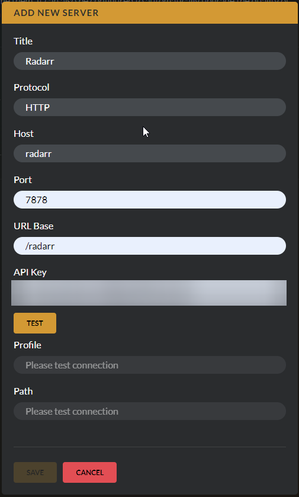

# Radarr

You can add multiple Radarr servers to your Petio instance. This will show you how to connect an existing Radarr server to Petio.


**NOTE:** We only support Radarr V3.



**NOTE:** In the screenshots below we assume you are using locally accessible docker containers that are on the same docker network as Petio.


## Step 1

Click on `Add New`

## Step 2

After clicking `Add New` you need to specify all your Radarr settings and give it a friendly name you can recognize. Your `host` and `port` fields will vary depending on what installation method you chose.

If you are hosting Radarr behind a reverse proxy and have configured a base URL, you need to specify it on the `URL Base` field. If this all sounds like alien speak, you don't have to write anything there.

You can obtain your Radarr API key by going to your Radarr instance and clicking on `Settings > General`.

## Step 3

Hit `Test` to make sure you configured it correctly. You will not be able to configure your `Profile` and `Path` without testing the connection ahead of time. You should see a little message on the bottom right that says `Radarr Test Connection success!`

Once you are done hit `Save` and you are ready to requests movies!

