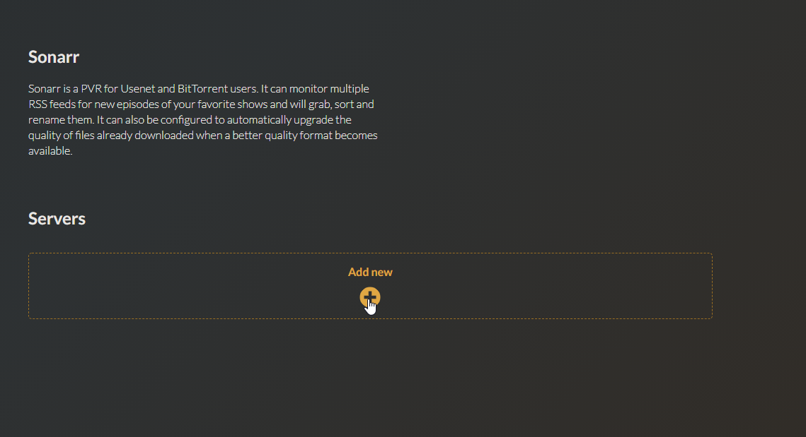
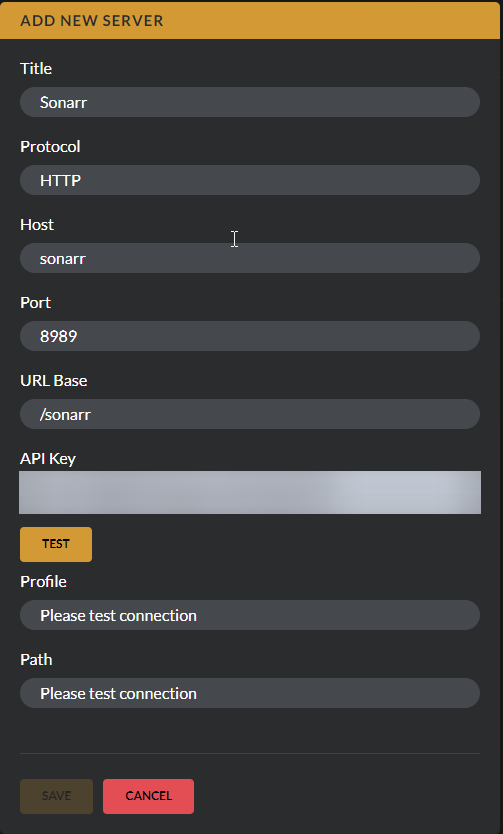
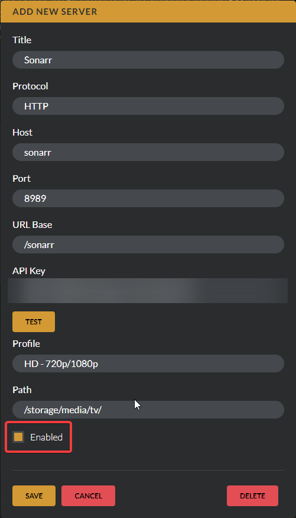

# Sonarr

You can add multiple Sonarr servers to your Petio instance. This will show you how to connect an existing Sonarr server to Petio.


We support all Sonnar versions for now. V2 support will be dropped soon



In the screenshots below we assume you are using locally accessible docker containers that are on the same docker network as Petio.


\*\*\*\*

## Step 1

Click on `Add New`

## Step 2

After clicking `Add New` you need to specify all your Sonarr settings and give it a friendly name you can recognize. Your `host` and `port` fields will vary depending on what installation method you chose.

If you are hosting Sonarr behind a reverse proxy and have configured a base URL, you need to specify it on the `URL Base` field. If this all sounds like alien speak, you don't have to write anything there.

You can obtain your Sonarr API key by going to your Sonarr instance and clicking on `Settings > General`.

## Step 3

Hit `Test` to make sure you configured it correctly. You will not be able to configure your `Profile` and `Path` without testing the connection ahead of time. You should see a little message on the bottom right that says `Sonarr Test Connection success!`

Once you are done hit `Save` and you are ready to requests TV Shows!

