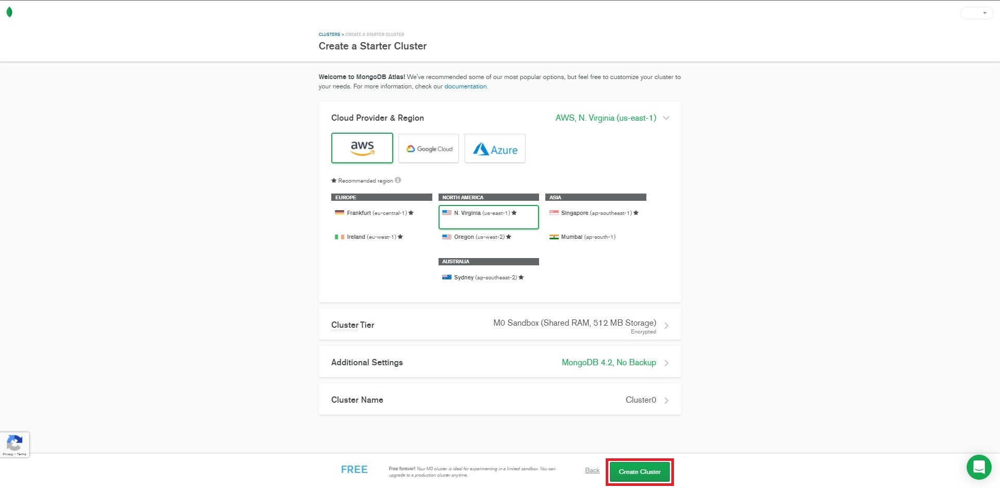

# Debian 10/Ubuntu 20.04

## MongoDB

Petio supports two ways of connecting to a Mongo Database instance, locally or remote. We recommend the locally hosted MongoDB option.

### **MongoDB Locally**


Make sure to add the correct repository to `apt` depending on whether you're using Debian or Ubuntu.


* Import the public key used by the package management system:

```bash
wget -qO - https://www.mongodb.org/static/pgp/server-4.4.asc | sudo apt-key add -
```

* Create the /etc/apt/sources.list.d/mongodb-org-4.4.list file:



```bash
echo "deb http://repo.mongodb.org/apt/debian buster/mongodb-org/4.4 main" | sudo tee /etc/apt/sources.list.d/mongodb-org-4.4.list
```



```bash
echo "deb [ arch=amd64,arm64 ] https://repo.mongodb.org/apt/ubuntu focal/mongodb-org/4.4 multiverse" | sudo tee /etc/apt/sources.list.d/mongodb-org-4.4.list
```



* Reload local package database:

```bash
sudo apt-get update
```

* Install the MongoDB packages:

```bash
sudo apt-get install -y mongodb-org
```

* Start MongoDB:

```bash
sudo systemctl start mongod
```

* Verify that MongoDB has started successfully:

```bash
sudo systemctl status mongod
```

* To make sure MongoDB starts after restart use:

```bash
sudo systemctl enable mongod
```

### MongoDB Locally - On A Different Host

By default, MongoDB doesn’t allow remote connections.

* Locate your `mongod.conf` and edit it with your favorite editor. Include any local IP addresses you want to allow to connect to your MongoDB instance.

```bash
vim /etc/mongod.conf
# /etc/mongod.conf
# Listen to local and LAN interfaces.
bind_ip = 127.0.0.1,192.168.161.100
```

* Restart the `mongod` service after making these changes

```bash
sudo systemctl restart mongod
```

If there is a firewall, you might need to use `iptables` to allow access to MongoDB. Example below:

* Any connections can connect to MongoDB on port 27017

```bash
iptables -A INPUT -p tcp --dport 27017 -j ACCEPT
```

* Only certain IPs can connect to MongoDB on port 27017

```bash
iptables -A INPUT -s <ip-address> -p tcp --destination-port 27017 -m state --state NEW,ESTABLISHED -j ACCEPT
iptables -A OUTPUT -d <ip-address> -p tcp --source-port 27017 -m state --state ESTABLISHED -j ACCEPT
```


### MongoDB Remotely

* Register for Atlas [here](https://www.mongodb.com/cloud/atlas/register).
* Create a free cluster.


* Change the provider or region if you need to. It may take some time to create the cluster.



* After the cluster is made, click on connect and select MongoDB Compass and follow the instructions on screen.


* Move on to the next section to start [installing Petio](debian-ubuntu.md#installing-petio).

## Installing Petio

* Create a user for Petio:

```bash
sudo useradd -M --shell=/bin/false petio
```

* Make a directory for Petio:

```bash
sudo mkdir /opt/Petio
```

* Download the latest version of Petio:

```bash
sudo wget https://petio.tv/releases/latest -O petio-latest.zip
```

* Extract Petio to the directory we just made:

```bash
sudo unzip petio-latest.zip -d /opt/Petio
```

* Change ownership of the directory for Petio:

```bash
sudo chown -R petio:petio /opt/Petio
```

* Create the petio service with systemd:


```bash
[Unit]
Description=Petio a content request system
After=network.target
StartLimitIntervalSec=0

[Service]
Type=simple
Restart=on-failure
RestartSec=1
ExecStart=/opt/Petio/bin/petio-linux
User=petio

[Install]
WantedBy=multi-user.target
```


* Reload systemd:

```bash
sudo systemctl daemon-reload
```

* Start Petio:

```bash
sudo systemctl start petio
```

Once you've completed theses steps, you can navigate to `http://<hostname>:7777` to start [configuring Petio](../../configuration/first-time-setup.md).

