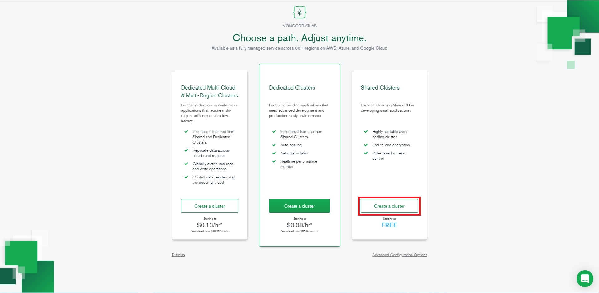

# Red Hat/Cent OS

## MongoDB

Petio supports two ways of connecting to a Mongo Database instance, locally or remote. We recommend the locally hosted MongoDB option.

### **MongoDB Locally**

* Configure the package management system \(yum\)
* Create a /etc/yum.repos.d/mongodb-org-4.4.repo file so that you can install MongoDB directly using yum:

```bash
sudo nano /etc/yum.repos.d/mongodb-org-4.4.repo
```

* Paste in the nano / terminal window:

```bash
[mongodb-org-4.4]
name=MongoDB Repository
baseurl=https://repo.mongodb.org/yum/redhat/$releasever/mongodb-org/4.4/x86_64/
gpgcheck=1
enabled=1
gpgkey=https://www.mongodb.org/static/pgp/server-4.4.asc
```

* Press: "CTRL + O" to save and "CTRL+X" to exit.
* To install the latest stable version of MongoDB, issue the following command:

```bash
sudo yum install -y mongodb-org
```

* Start MongoDB:

```bash
sudo systemctl start mongod
```

* Verify that MongoDB has started successfully:

```bash
sudo systemctl status mongod
```

* To make sure MongoDB starts after restart use:

```bash
sudo systemctl enable mongod
```

### \*\*\*\*

### MongoDB Remotely

* Register for Atlas [here](https://www.mongodb.com/cloud/atlas/register).
* Create a free cluster.



* Change the provider or region if you need to. It may take some time to create the cluster.


* After the cluster is made, click on connect and select MongoDB Compass and follow the instructions on screen.


* Move on to the next section to start [installing Petio](red-hat-cent-os.md#installing-petio).

## Installing Petio

* Create a user for Petio:

```bash
sudo useradd -M --shell=/bin/false petio
```

* Make a directory for Petio:

```bash
sudo mkdir /opt/Petio
```

* Download the latest version of Petio:

```bash
sudo wget https://petio.tv/releases/latest -O petio-latest.zip
```

* Extract Petio to the directory we just made:

```bash
sudo unzip petio-latest.zip -d /opt/Petio
```

* Change ownership of the directory for Petio:

```bash
sudo chown -R petio:petio /opt/Petio
```

* Create the petio service with systemd:

```bash
sudo vi /etc/systemd/system/petio.service

[Unit]
Description=Petio a content request system
After=network.target
StartLimitIntervalSec=0

[Service]
Type=simple
Restart=on-failure
RestartSec=1
ExecStart=/opt/Petio/bin/petio-linux
User=petio

[Install]
WantedBy=multi-user.target
```

* Reload systemd:

```bash
sudo systemctl daemon-reload
```

* Start Petio:

```bash
sudo systemctl start petio
```

Once you've completed theses steps, you can navigate to `http://<hostname>:7777` to start [configuring Petio](../../configuration/first-time-setup.md).

