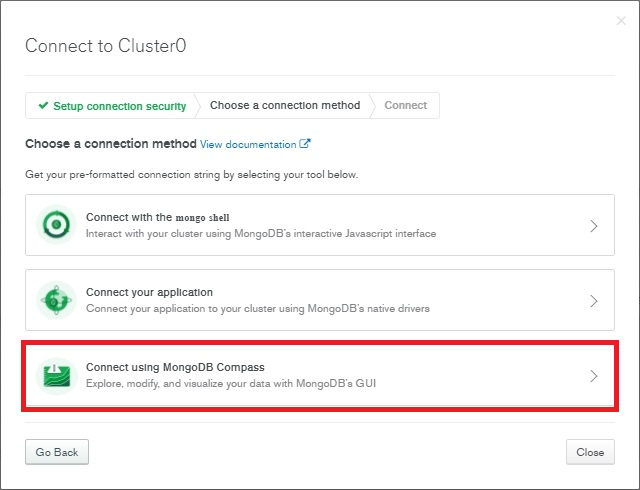

# UnRAID

## MongoDB

### Template

### Community Applications

### 

### MongoDB Remotely

* Register for Atlas [here](https://www.mongodb.com/cloud/atlas/register).
* Create a free cluster.

* Change the provider or region if you need to. It may take some time to create the cluster.

* After the cluster is made, click on connect and select MongoDB Compass and follow the instructions on screen.

* Move on to the next section to start [installing Petio](unraid.md#petio).

## Petio

There are two ways to get Petio installed on unRAID. You can either import your own template or install it from the Community Applications plugin.

### Template

* Add the repo to `Template Repositories` under the Docker header:
  * [https://github.com/PotentialIngenuity/petio-unraid](https://github.com/PotentialIngenuity/petio-unraid)

* Click on`Add Container`

* Configure the container like all the others on unRAID.

### Community Applications

* Go to the Apps page within unRAID and search for `Petio`. You can use either use ChargingCosmonaut's \(Official\) or Hotio's template.

* Configure the container like all the others on unRAID.

Once you've completed theses steps, you can navigate to `http://<hostname>:7777` to start [configuring Petio](../configuration/first-time-setup.md).

