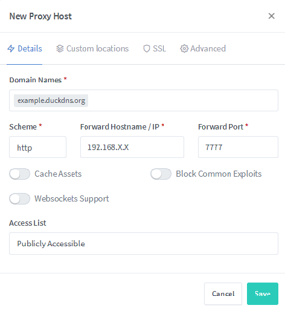
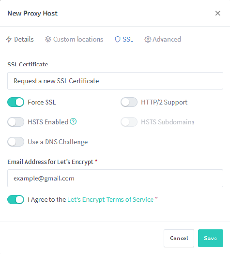

# NGINX

## Nginx Subdomain example

```text
server {
    listen 443 ssl;
    listen [::]:443 ssl;

    # Make sure you create a CNAME with your domain registrar
    server_name petio.*;

    include /config/nginx/ssl.conf;

    client_max_body_size 0;

    location / {
    
        # Delete the line below if you aren't using LSIO's SWAG container
        # or if you don't have a file called "proxy.conf"
        include /config/nginx/proxy.conf;

        # Delete the line below if you aren't using Docker DNS
        resolver 127.0.0.11 valid=30s;

        # Change the word petio below to the IP 
        # of where Petio is installed if you aren't using Docker DNS
        set $upstream_app petio;

        # You can leave the next 3 lines as is,
        # unless you are using a different port 
        # or you are somehow using HTTPS internally
        set $upstream_port 7777;
        set $upstream_proto http;
        proxy_pass $upstream_proto://$upstream_app:$upstream_port;
    }

    # This is optional and only if you want to protect your `/admin` endpoint
    # with some sort of auth in front of it.
    # No auth example is being provided
    
    location /admin/ {
    
        # Delete the line below if you aren't using LSIO's SWAG container
        # or if you don't have a file called "proxy.conf"
        include /config/nginx/proxy.conf;
        
        # Delete the line below if you aren't using Docker DNS
        resolver 127.0.0.11 valid=30s;

        # Change the line below to the IP 
        # of where Petio is installed if you aren't using Docker DNS
        set $upstream_app petio;
        
        # You can leave the next 3 lines as is,
        # unless you are using a different port 
        # or you are somehow using HTTPS internally
        set $upstream_port 7777;
        set $upstream_proto http;
        proxy_pass $upstream_proto://$upstream_app:$upstream_port;
    }
}
```

## Nginx Subdirectory Example

Make sure you've set a [base path](../configuration/general-settings.md#base-path).

```text
location ^~ /petio {

    # Delete the line below if you aren't using LSIO's SWAG container
    # or if you don't have a file called "proxy.conf"
    include /config/nginx/proxy.conf;
    
    # Change the word petio below to the IP 
    # of where Petio is installed if you aren't using Docker DNS
    set $upstream_app petio;
    
    # You can leave the next 3 lines as is,
    # unless you are using a different port 
    # or you are somehow using HTTPS internally
    set $upstream_port 7777;
    set $upstream_proto http;
    proxy_pass $upstream_proto://$upstream_app:$upstream_port;
}
```

## Nginx Proxy Manager

Expose web services on your network · Free SSL with Let's Encrypt · Designed with security in mind · Perfect for home networks

* Install the latest version of [NGINX Proxy Manager](https://nginxproxymanager.com/#quick-setup/).
* Click on "Proxy Hosts" on the dashboard.
* Click on "Add Proxy Host".

### Details Tab

* Domain names: add your domain. For example: `example.duckdns.org`.
* Scheme: keep at `http`.
* Forward hostname/IP: add your host IP. For example: `192.168.X.X` or `localhost`.
* Forward port: add the port for petio i.e.`7777`.
* Access list: set to `Publicly Accessible`.



### SSL Tab

* SSL Certificate: Select "Request a new SSL Certificate".
* Enable "Force SSL"
* Email address for Let's Encrypt: type in the email you want to use for registration on Let's encrypt.
* Click on the "I Agree to the Let's Encrypt Terms of Service" box.
* Hit save and your all done. 



Now you should be able to access Petio from your domain name.


